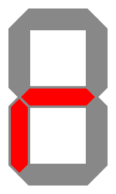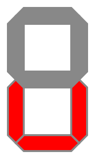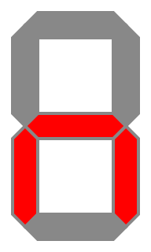

# **runUp**: Arduino Pomodoro Timer

Pomodoro timer implementation for **Arduino Uno R3** (or compatible) using a **Multifunction Shield** and a **DS1302 RTC module**. It helps manage work in focused sprints, track productivity with daily historical statistics stored in EEPROM and customize timer behavior with various settings.

The runUp device is easy to assemble and requires no soldering. It uses widely available, low-cost components, making it accessible for hobbyists and beginners. The Multifunction Shield plugs directly onto the Arduino Uno and the DS1302 RTC module connects via simple jumper wires.

The device can be placed into a simple DIY enclosure. Using two transparent acrylic Arduino Uno cases, hex standoffs, bamboo sushi stick and heat-shrink tubing, you can easily build a good-looking case.

## Features

### Sprint sessions

The runUp device follows the classic [Pomodoro technique](https://en.wikipedia.org/wiki/Pomodoro_Technique). Work sessions last **25 minutes**, during which you should focus solely on your task without distractions. Short **5-minute** breaks occur between each session and after every **four** completed sessions, a longer **15-minute** break is taken. This cycle repeats continuously to help maintain focus and productivity.

| Session Type      | Duration | Notes                                      |
|-------------------|----------|--------------------------------------------|
| Work              | 25 min   | Focused work, no distractions              |
| Short Break       | 5 min    | Quick rest, stretch                        |
| Long Break        | 15 min   | After every 4 work sessions, extended rest |

### Statistics tracking

The [**Statistics menu**](#statistics-data-menu) contains statistical data that allows you to track your progress.

- Saves the number of completed sprints per day in EEPROM
- Provides flexible periods for calculated statistics, including daily, monthly, and yearly data
- Shows statistics with minimum, average and maximum values

### Customizable settings

There are **one-click modes**: temporary modes activated while the device is powered on with a simple button hold. These modes are not saved, so there is no need to manually toggle settings in the [**Configuration menu**](#settings-conf-menu). Once the device is turned off, the temporary modes are reset.

- **Silent mode**: turns off all sounds
- **No-music mode**: turns off melody playback but keeps simple beeps
- **Hero mode**: repeats 25-minute work sessions without breaks

There are also customizable settings that can be saved in EEPROM through the **Configuration menu**:

- **Display**: 4 brightness levels
- **Sound**: silent mode, simple beeps or 14 built-in melodies
- **Reminders**: beeps during pauses or breaks
- **LED**: progress indication via flickering light
- **Statistics**: flexible calculation logic with selectable units (hours or sprints)
  - Only weekdays
  - Weekdays and weekends
  - All non-zero days
- **Hero mode**: repeats 25-minute work sessions without breaks
- **Sleep mode**: reduces power consumption

### Date and time handling

The RTC (real-time clock) module keeps track of the current date and time even when the device is powered off. The date and time can be set through the [**Clock menu**](#date-and-time-cloc-menu), making it easy to monitor daily progress and align work sessions with real-world schedules.

## Hardware

- **Arduino Uno R3** (or compatible)
- **Multifunction Shield** (MFS)
- **DS1302** RTC module (with CR2032 battery)
- DuPont jumper wires (5x female-to-female, 20 cm each)
- Power cable for Arduino

### Connection and wiring diagram

> ⚠️ **Warning:** When mounting the Multifunction Shield on the Arduino Uno with a USB Type-B socket, ensure the underside of the shield **does not touch** the metal parts of the socket. Contact may cause a short circuit when powering the device. Use a thin piece of insulating material (like a plastic card) between the boards to prevent accidental contact.

- DS1302 connects to MFS pins:
  - `RST` → `~5`
  - `DAT` → `~6`
  - `CLK` → `~9`
  - `VCC` → `+5V`
  - `GND` → `GND`
- MFS (with jumper near the buttons) plugs directly onto Arduino
- USB power cable (5 V) or external power connects to Arduino

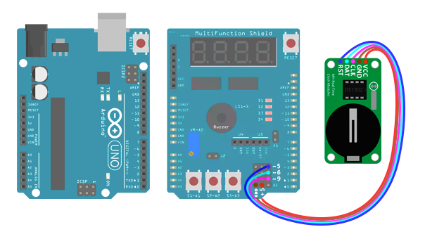

### RTC module

If you plan to build an enclosure or want to keep the DS1302 RTC module hidden under the MFS, you may need to trim the module's corners (depending on the board's component layout) and bend its contacts to 90° so it can fit between the boards, as shown with red marks in the illustration below. Do this carefully to avoid damaging the module's tracks.

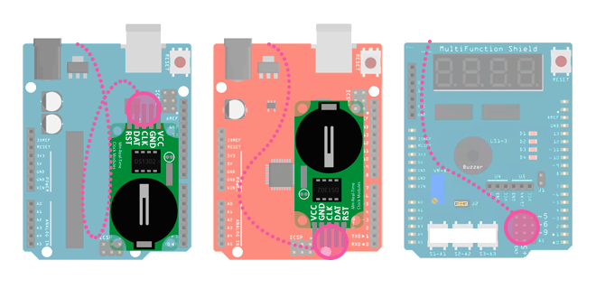

> ⚠️ **Warning:** Be sure to insulate the DS1302 RTC module with tape to prevent accidental damage or short circuits. You may also need to trim the pins or leads of the module's components if they are too long and prevent it from fitting between the boards.

On the MFS, place a jumper wire from the bottom-right group of pins, routing it between the buzzer and the blue trimmer resistor and then up through the top side of the shield, as shown with green marks above. From there, lead the wire through the top part of the Arduino (between the USB socket and the 9V power input) and connect it to the DS1302, which is located between the boards.

Note that the wire routing and RTC module position depend on the board's component layout and the jumper wire length, so they may differ from the illustration shown here in your case.

## Enclosure

### Tools

You will need the following tools to build the enclosure:

- Wire cutters, pliers, awl, utility knife (for case walls, holes and button rods)
- Flat and round files (for smoothing and adjusting case walls and rod edges)
- Lighter or matches (for shrinking heat-shrink tubing)
- Black permanent marker (for coloring button rods)

### Parts

The enclosure can be assembled from the following components:

- Two transparent acrylic Arduino Uno cases
- Hex standoffs (M3 threaded, with screws and nuts) for fixing the enclosure
- Bamboo sushi stick pieces as button rods
- Heat-shrink tubing to hold button rods and case walls in place

It's best to have sets of different M3 hex standoffs and heat-shrink tubing to test-fit the optimal sizes. In my case, the following dimensions worked best:

#### M3 hex standoff

Optimal body length: **2 x 32 mm** (bottom part) and **2 x 30 mm** (top part). These measurements refer to the standoff body only and do not include the **6 mm** threaded sections on each end. They can be combined from **20 mm**, **12 mm** and **10 mm** pieces.

#### Heat-shrink tubing

Optimal inner diameter: **6 mm** for the button rods, **3 mm** for the case walls.

### Assembly

#### Step 1: Preparing the case parts

For the front (with buttons) and back (opposite) sides of the enclosure, use two big bottom parts of Arduino Uno acrylic cases, as shown below.

#### Step 2: Enlarging corner and button holes

If you plan to use M3 threaded hex standoffs, first enlarge the four corner mounting holes in the front and back parts of the enclosure (see red marks). Then mount the Arduino with screws on the back side of the enclosure and plug the MFS directly onto it.

Assemble the front and back sides of the enclosure, then mark the positions of the future button holes — 3 for MFS bottom buttons and 1 for reset button — on the front panel, as shown with purple marks in the illustration below.

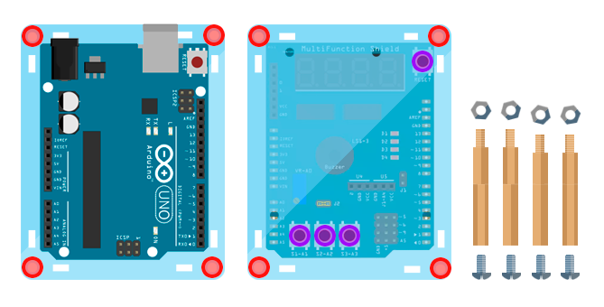

Make the holes with an awl and carefully enlarge them with a round file until they match the diameter of your button rods (sushi sticks or something similar). Try to make it as precise as possible, because if the holes are too large or misaligned with the buttons, pressing them and using the runUp device will be difficult.

#### Step 3: Preparing the button rods

Cut the sushi sticks into 4 pieces: 3 for the MFS bottom buttons (about **14 mm** high) and 1 for the reset button (about **11 mm** high). The reset button rod is shorter due to the height difference between the top and bottom parts of the enclosure. The jump wire connectors at the bottom increase the height, but if you are comfortable with soldering, you can make the enclosure symmetrical.

Exact dimensions may vary depending on your specific board, so remember: **measure twice, cut once**. Each button rod should extend roughly **1-2 mm** above the front surface of the enclosure, because if the rods are too short or too tall, pressing them will be difficult.

Once you have finished sizing the rods, use a utility knife to make small recesses on the bottom side of each rod — this will make them more stable when mounted on the MFS buttons. Then slide a heat-shrink tube onto each rod (inner diameter **6 mm**), leaving about **3 mm** length exposed at the top and use a lighter to shrink the tube. This will hold the rods in place so they won't fall out if you turn your device upside down.

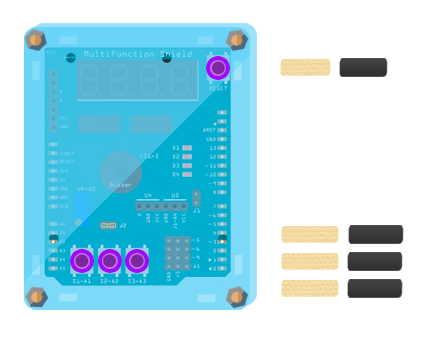

Use a black permanent marker to color the button rods so the heat-shrink tubing blends in.

#### Step 4: Preparing the side walls

Assemble case parts with the standoffs and test-fit the case walls to check the alignment.

Use a utility knife and a flat file to adjust the walls at the marked positions (shown below) until they fit properly with the standoffs. Secure each pair of walls in a stacked position with heat-shrink tubing (3 mm fits well, even without heating).

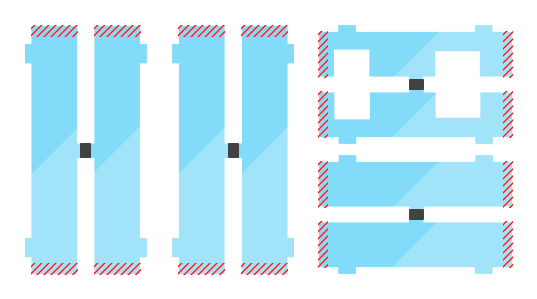

#### Step 5: Final look

After routing the jumper wire and assembling the enclosure, the device should look like this:

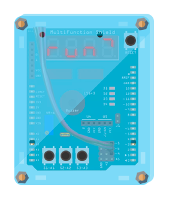

## Software

### Libraries

The runUp device uses my fork of the **Multifunction Shield library** by Kashif Baig and Cohesive Computing. It also requires the **Rtc library** by Michael Miller (Makuna), along with the built-in Arduino libraries for EEPROM and Sleep Mode support.

- [Multifunction Shield library](https://github.com/beschasny/MultiFuncShield-Library)
- [RTC library](https://github.com/Makuna/Rtc)
- Built-in: EEPROM, avr/sleep

### Uploading the program

After assembling the device and reading the note below, upload the program sketch via USB cable using the Arduino IDE or any other environment that supports uploading. If everything works as expected, the display will either show the first menu item or the date and time settings, depending on your setup and initial conditions (such as the RTC module settings and EEPROM contents).

> ℹ️ **Note:** The device uses EEPROM. If your Arduino already has data stored there, you'll need to clear it for proper operation. This can be done directly with the device, as you will see later.

## Usage

There are 4 buttons to operate the device. The reset button `◆` is located at the top right corner and works the same way as on standard Arduino boards.

At the bottom of the MFS, there are three buttons used to operate the device menu and its functions:

1. **Back** `◀` : exit or cancel
2. **Switch** `▲▼` : switch the current menu item or adjust a value
3. **OK** `▶` : enter a menu or confirm a selection

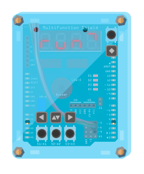

### First start

So, if this is the first run with a fresh battery, you need to set up the current date and time for the device to work properly. In this case, after powering on, you will see the default values, with first digit blinking:

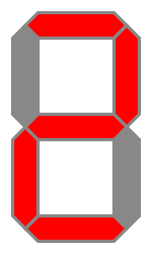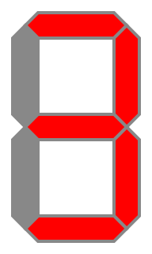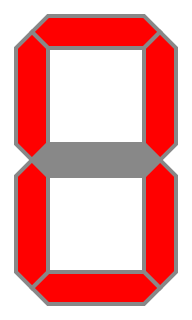

Use the **Switch** `▲▼` button to change the first digit and press **OK** `▶` to move to the next digit to set the hours. Use the same logic to set the minutes and press **OK** `▶` again. You'll see the default values of the date and month:

Use the **Switch** `▲▼` and **OK** `▶` buttons to change the digits, just like before. After you set the date and month, do the same to set the year (just the last 2 digits – changing the first two might make your device question reality):

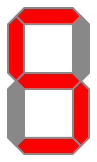

When you're done, press and hold the **OK** `▶` button for **2 seconds** to save your changes and exit the date and time setup.

You'll then return to the main menu, which contains four top-level items: **run**, **data**, **conf** and **cloc**. Use the **Switch** `▲▼` button to cycle through the menu items, the **OK** `▶` button to enter a selected menu and the **Back** `◀` button to exit.

### Sprints (`run` menu)

This is one of the main menus used to start and manage sprints. Press the **OK** `▶` button to enter this menu. After a short animation showing your daily progress, you will see the timer value. If there is no active interval, the default 25-minute sprint interval is shown; otherwise, the remaining time of the current sprint is displayed.

#### Start the sprint

In the **run** menu, press the **OK** `▶` button to start or continue the sprint. The countdown timer will then appear on the device's screen. The four on-board LEDs show progress in blocks of four intervals: completed ones stay lit and the current one blinks. LEDs are active only if the **Flicker** setting is enabled (see [**Settings**](#settings-conf-menu)).

> ℹ️ **Example:** After completing the first sprint, the first LED stays on; when the second sprint starts, the second LED blinks while the first remains lit; after completing the second sprint, both the first and second LEDs stay on and the third LED starts blinking during the third sprint. This pattern continues and after completing four intervals, the LED cycle loops again, showing progress for the next set of four sprints (we are limited to four LEDs on the device).

#### Pause the sprint

The best strategy is to concentrate on your work and complete the sprint without any interruptions or distractions. But life is life, so if your cat decides to stress-test your brand-new sofa or if there is an asteroid fall alert, you will probably need to pause for a minute or two. In these cases, press the **OK** `▶` button and your current sprint will be paused. Press it again to resume when ready.

During a pause, the last digit on the display will blink. Also, if the **Cue** setting is enabled (see [**Settings**](#settings-conf-menu)), the buzzer will emit a short beep every minute to remind you that the sprint is paused.

If you need to exit to the main menu during a pause to view statistics or change settings, your current sprint will be held until you turn off the device or resume the sprint.

#### Cancel the sprint

If you need to cancel the current sprint, pause it first, then press and hold the **Back** `◀` button for **2 seconds**. After that, the device will reset the current sprint and show the default 25-minute sprint interval, keeping you in the **run** menu.

 Press the **OK** `▶` button to start a new sprint or the **Back** `◀` button to exit to the main menu.

#### Using one-click modes

There are three temporary one-click modes to enhance your sprint experiance. They can be enabled or disabled only during a sprint by pressing and holding one of the buttons for **2 seconds**. These modes are temporary; they remain active only until you turn off the device or disable them manually.

> ℹ️ **Example:** If there is an emergency online meeting with your very serious colleagues and *A-ha – Take On Me* does not feel like the most appropriate background music, all sounds can be temporarily disabled using the **Back** `◀` button, without opening the settings or interrupting your workflow. Once the meeting ends, you can re-enable sound using the same button.

Once you press and hold the appropriate button, an information alert showing the current mode and its status (on or off) will appear on the display.

#### Silent mode

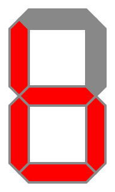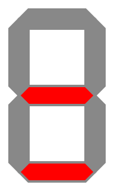

Press and hold the **Back** `◀` button to mute the buzzer and disable all sounds.

#### No-music mode

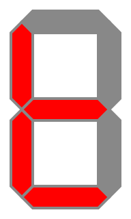

Press and hold the **Switch** `▲▼` button to turn off melody (tunes) playback while keeping simple beeps.

#### Hero mode

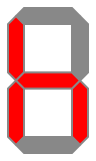

Press and hold the **OK** `▶` button to repeat 25-minute work sessions without breaks, like a hero.

#### Saving the sprint

After the sprint is completed, a success message is displayed on the screen with a short animation indicating your current daily progress. Once the animation finishes, the sprint counter is saved to EEPROM at the cell corresponding to the current day of the year.

If the device is powered off or enters hibernation, your progress will not be lost, as it is stored in non-volatile EEPROM memory. When you turn the device back on, the latest sprint counter for the current day is restored. If no counter is saved for the current day, it starts from 0. If you skip some days, their values will also be filled with zeros for data consistency.

If an interval is started near midnight and finishes the next day, the sprint counter is saved to the next day's cell. This is because progress is recorded only when the interval is completed, regardless of when it was started.

### Statistics (`data` menu)

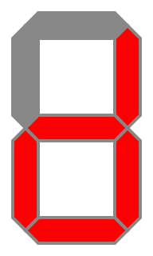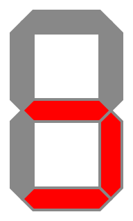

This is one of the main menus used to view and manage statistical data. Press the **OK** `▶` button to enter it. The menu contains several elements showing different metrics:

- **Now**: progress for today
- **Daily**: daily progress for any day of the year
- **Total**, **Minimum**, **Average**, **Maximum**: calculated statistics for a selected period
- **Clear**: erase all statistics

The device currently uses 366 EEPROM cells to store sprint data, one cell for each day of the year. If you use the device for more than a year, older data will be overwritten.

Statistical data calculation depends on a setting called **Counted Days of Week** (**cnt.d** in the [**Settings**](#settings-conf-menu)). This setting defines which days of the week are included in the calculation (weekdays, weekends or all non-zero day).

All statistics are displayed in the selected counting unit (sprints or hours). This can be changed using the **Count Units** setting (**cnt.u** in the [**Settings**](#settings-conf-menu)).

#### Today statistics (`now` submenu)

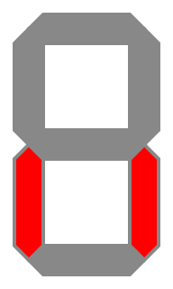

The **now** submenu displays your current statistics for today, automatically cycling between sprint count and total hours every 1.5 seconds. To exit this submenu (as well as any other submenu, since this behavior is consistent), press the **Back** `◀` button.

#### Per-day statistics (`daily` submenu)

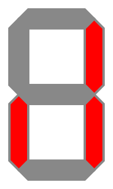

The **daily** submenu displays your statistics for any day of the year except today. After entering this menu, use the **Switch** `▲▼` button to select a specific date, then press the **OK** `▶` button to view it and the **Back** `◀` button to exit.

For faster date selection, press and hold the **Switch** `▲▼` button. Dates scroll backward, starting from yesterday and moving further into the past.

#### Period-based statistics (`totl`, `min`, `mid`, `max` submenus)

There are four submenus with the same logic, so they are grouped into a single section here:

- Total statistics by period (**totl** submenu)
- Minimum statistics by period (**min** submenu)
- Average statistics by period (**mid** submenu)
- Maximum statistics by period (**max** submenu)

In any of these submenus, use the **Switch** `▲▼` button to select a period, then press the **OK** `▶` button to view it and the **Back** `◀` button to exit. These submenus display different types of statistics – total, minimum, average and maximum values – for the following periods:

- Rolling 365 days
- Rolling 100 days
- Rolling 60 days
- Rolling 30 days
- Rolling 7 days
- A specific month

> ℹ️ **Note:** If you have been using the device for a long time, its memory may be full and older data will be overwritten as intended. For example, if it is currently June and you try to view August data, the device cannot show future data, so it interprets it as past data and displays the same period from last year (if the device was in use at that time).

### Settings (`conf` menu)

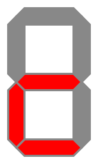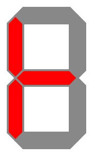

Coming soon.

### Date and time (`cloc` menu)

Coming soon.

---

## Releases

See [Releases](../../releases) for tagged versions.
Current stable release: **v1.2.1**

---

## License

This project is licensed under the [MIT License](LICENSE).

---

## Author

👤 [beschasny](https://github.com/beschasny)
